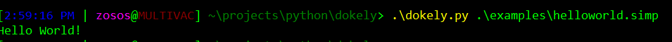
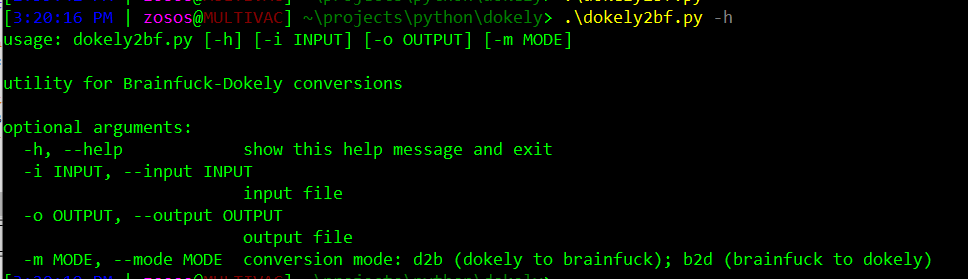

# Dokely


#### The TBE programming language for Ned Flanders

### Why?
I think its hilarious to have a fully turing complete language comprised of flanderisms as its base symbols.
I also wanted to learn a bit more about escoteric programming languages/brainfuck

also because why not? 

### dokely.py
Acts at the dokely interpreter. To use, just run it with the target ".simp" file as its only argument

note that all valid dokely files are required to have:
- The proper header (i.e. "Hi")
- The proper footer (i.e. "ho neighboreeno!")
- a ".simp" extension

## Usage
``` $ dokely.py filename.simp```

#### Ex:




## Examples

##### Prints a Sierpinski triangle to stdout
```
Hi doodley diggity dokely diddily dong dang dang dang dang doodley 
ding dang dang dang dang dang dang dang dang dong diggity diddily 
dong dang dang dang dang dang dang dang dang doodley dong dang dang
dang dang ding diggity diddily dong dong dang dang dong dong dong 
dang dong dong dong dang ding ding ding ding ding ding ding ding ding
ding doodley diggity doodley diggity dong dang ding diddily dong doodley
diggity ding dang dong dong dong dokely ding ding diddily dong dong dong 
doodley doodley diggity dong dang dang dang dang dang dang dang dang
doodley dong dang dang dang dang ding diggity diddily dong dokely
ding ding doodley diggity dong dang ding diddily dang dong doodley diggity 
dong dang dang dang dang dang dang dang dang dang dang ding ding dang dong 
diddily dong dokely doodley diggity diddily dong diddily diddily dang ding 
ding ding doodley diggity doodley diggity dong dang ding diddily dang dong 
doodley diggity ding dang dong dong dong diggity doodley diggity dong dang 
ding diddily dang dang dong doodley diggity ding diggity dong diddily ding 
ding ding diddily ding ding ding ding diddily dang dang dang dang dang dang 
dang dang dang dang dokely dang dang dang dokely doodley diggity diddily 
ding diddily dang dang dang dang dang ho neighboreeno!    
```
###### Output
```
                                *    

                               * *    

                              *   *    

                             * * * *    

                            *       *    

                           * *     * *    

                          *   *   *   *    

                         * * * * * * * *    

                        *               *    

                       * *             * *    

                      *   *           *   *    

                     * * * *         * * * *    

                    *       *       *       *    

                   * *     * *     * *     * *    

                  *   *   *   *   *   *   *   *    

                 * * * * * * * * * * * * * * * *    

                *                               *    

               * *                             * *    

              *   *                           *   *    

             * * * *                         * * * *    

            *       *                       *       *    

           * *     * *                     * *     * *    

          *   *   *   *                   *   *   *   *    

         * * * * * * * *                 * * * * * * * *    

        *               *               *               *    

       * *             * *             * *             * *    

      *   *           *   *           *   *           *   *    

     * * * *         * * * *         * * * *         * * * *    

    *       *       *       *       *       *       *       *    

   * *     * *     * *     * *     * *     * *     * *     * *    

  *   *   *   *   *   *   *   *   *   *   *   *   *   *   *   *    

 * * * * * * * * * * * * * * * * * * * * * * * * * * * * * * * *    
```

examples of valid dokely programs can be found [here](https://github.com/saulpanders/dokely/examples)

### dokely2bf.py
Utility for converting between dokely and brainfuck. Makes the language infinitely more usable and fun!


## Usage
- convert dokely to brainfuck
``` $ dokely2bf.py -i infile -o outfile -m d2b```

- convert brainfuck to dokely
``` $ dokely2bf.py -i infile -o outfile -m b2d```

#### Ex:



## Installation
Download or install the repo using:```$ git clone https://github.com/omkarjc27/OooWee```

## Command Syntax
| Dokely 	| BFE	|	What it does																										|
| ---------	| ------|---------------------------------------------------------------------------------------------------------------------- |
|	ding	| 	<	|	increment data ptr (ptr++)																							|
|	dong	| 	>	|	decrement data ptr (ptr--)																							|
|	dang	|	+	|	increase by 1 the byte at the data ptr (*ptr++)																		|
|	diggity	|	-	|	decrease by 1 the byte at the data ptr (*ptr--)																		|
|	dokely 	| 	.	|	output byte at data ptr (print(*ptr))																				|
|	daddley	|	,	|	read 1 byte of input and store its value at byte pointed to by data ptr 											|
|	doodley	|	[	|	if byte at data ptr is zero, instead of increasing instruction pointer JUMP to instruction after subsequent "]"		|
|	diddily	|	]	|	if byte at data ptr is zero, instead of increasing instruction pointer JUMP to instruction after previous "["		|

note: BFE == Brain Fuck Eqiuvalent 